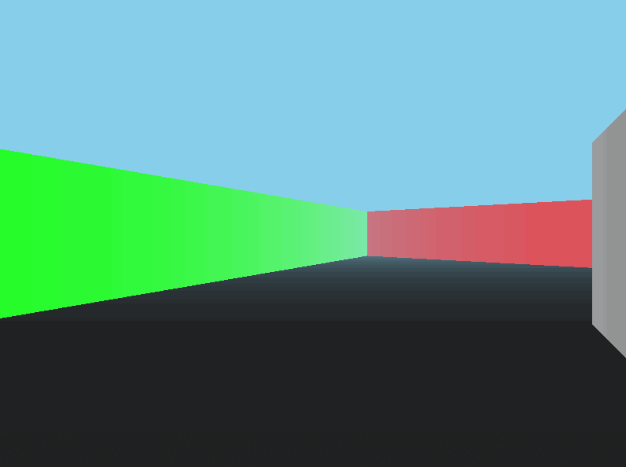

# Lesser Doom

**Experiments with Doom-style rendering in C**

Features multi-threaded rendering, specular highlights, fog, and different colored materials.

This is a pretty barebones impementation. It utilizes OpenGL for rendering a textured quad; all rendering is done to an array which is then streamed to the texture.

## Controls

| Key | Action |
|-----|---------|
| **W,A,S,D** | Movement |
| **Mouse/Trackpad** | Camera* |
| **Left/Right arrow keys** | Alt. Camera |

**(I haven't looked into it yet, but on Ubuntu the mouse is waaay too fast)*

## Example



## Build

This project uses CMake. You can use your preferred build system for building.

OpenGL, GLEW, and SDL2 are required to build this project.

### Ubuntu

Run the following command to install the required dependencies.

```
sudo apt install cmake libglew libglew-dev libsdl2-2.0-0 libsdl2-dev libglu1-mesa-dev freeglut3-dev mesa-common-dev
```

From the root of `lesser-doom` run:

``` 
mkdir build && cd build 
```

This project required some modern features of C. Before running CMake, it may be required to point CMake to your modern compiler, otherwise it may find a C89 compiler like it was on my machine. If this is the case, make sure to set the environment variable for CMake to find the correct compiler; this will only need to be done once (or anytime you delete your `CMakeCache.txt`).

```
export CC=/usr/bin/gcc
```

now run CMake and then build:

```
cmake .. && cmake --build .
```

There is a chance the program says something like 
> "SDL: OpenGL context could not be created!"

In this case, that version of OpenGL is probably not supported on your machine; you can instead use software rendering by running the program with an additional environment variable:

`LIBGL_ALWAYS_SOFTWARE=1 ./lesser-doom`